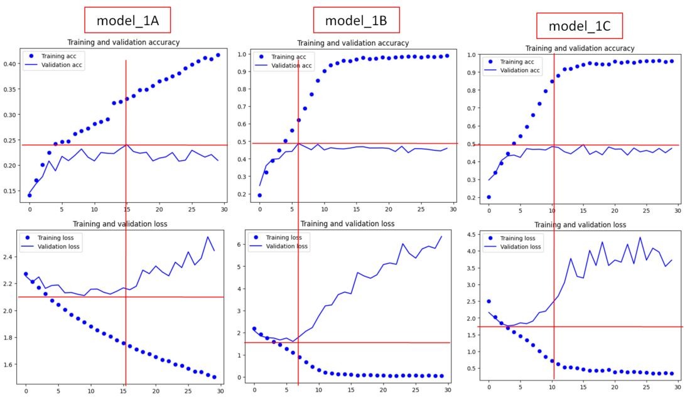
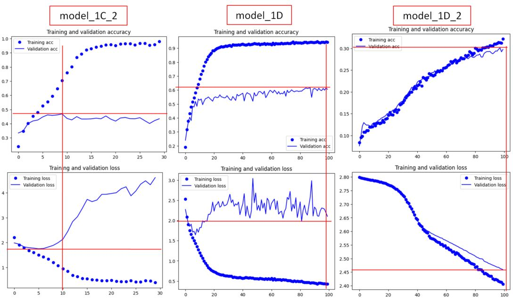
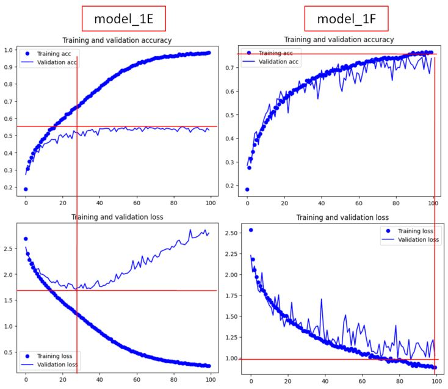
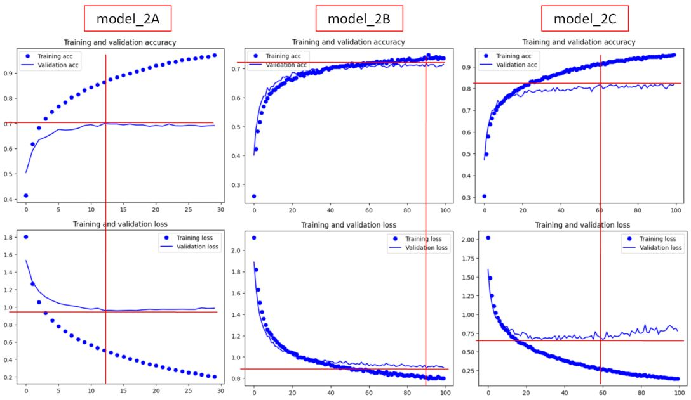
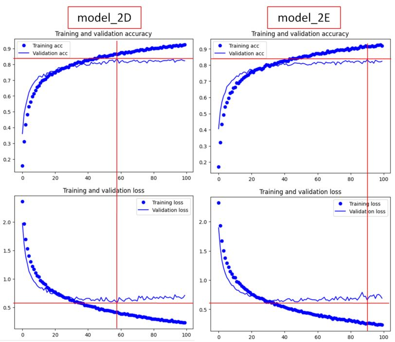
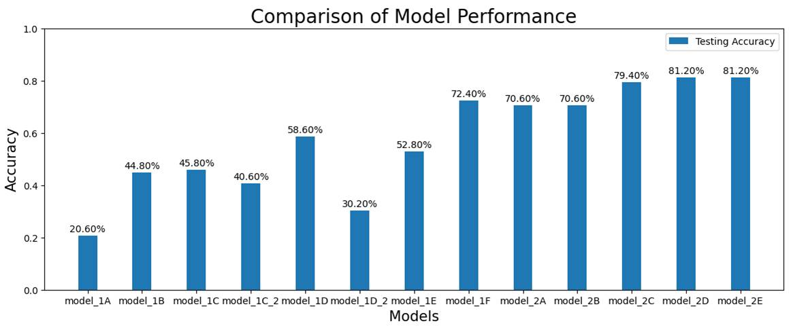
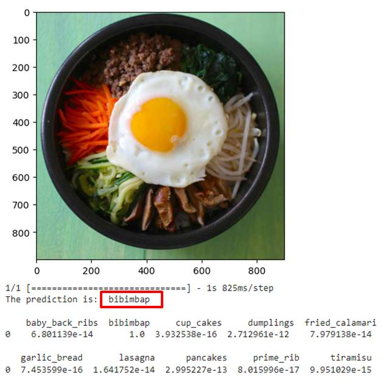
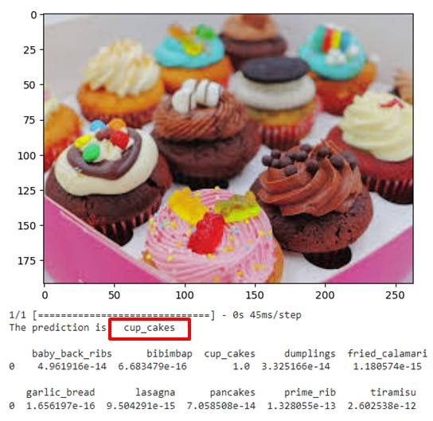
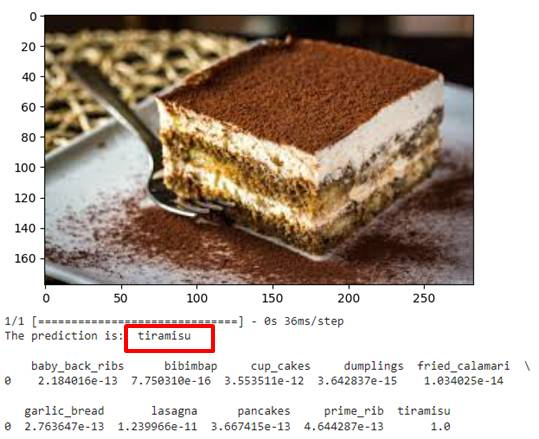

# Image Classification using Convolutional Neural Network (CNN or ConvNet)

## Table of Contents
1. [Overview](README.md#overview)
2. [Data Preprocessing and Data Loading](README.md#data-preprocessing-and-data-loading)
3. [Image Classification Model 1: Train from Scratch](README.md#image-classification-model-1-train-from-scratch)
4. [Image Classification Model 2: Utilizing Pre-Train Model](README.md#image-classification-model-2-utilizing-pre-train-model)
5. [Evaluate Models using Test images](README.md#evaluate-models-using-test-images)
6. [Best Model to Perform Classification](README.md#best-model-to-perform-classification)
7. [Summary](README.md#summary)

## Overview
* **Objective**: To build an image classification model to recognize and classify 10 different types of food
* **Framework: Universal Workflow of Machine Learning** 
    a. Define the problem and assemble a dataset 
    b. Choose a measure of success 
    c. Decide on an evaluation protocol 
    d. Prepare the data 
    e. Develop a model that does better than a baseline 
    f. Develop a model that overfits 
    g. Regularize the model and tune its hyperparameters 
    
* **Type of Problem**: A multiclass classification problem with 10 classes of output
* **Inputs and Outputs**:
    * Inputs (training): 750 food images per type
    * Inputs (validation): 200 food images per type
    * Inputs (testing): 50 food images per type
    * Output: Food labels 
* **Measure of Success**: Accuracy
* **Evaluation Protocol**: Maintaining a hold-out validation set (Dataset is huge – images)

## Data Preprocessing and Data Loading
* **Platform**: Google Colab
* **Library / Packages**: Tensorflow, Keras, ImageDataGenerator
* **Data Loading**: Link up folder directory of training, validation and testing dataset
* **Data Preprocessing**: 
    * Rescale pixel values (0 to 255) to [0,1] interval by dividing by 255
    * Standardize image size to 150 x 150 px
  
## Image Classification Model 1: Train from Scratch
* **Library / Packages**: Tensorflow, Keras, Layers, Models, Optimizers, Pyplot, Matplotlib 
* **Build the Model**: We start with a baseline model (model_1A) and build up and improve the model subsequently
* **Model_1A (Baseline)**:
    * Model Type: Sequential
    * Feature Extraction Layers
      * Conv2D (ConvNet)
      * Activation Function: ReLU
      * Number of filters; Filter size: 3 x 3 px
      * Input image size: 150 x 150 px; 3 channels
      * Max-Pooling: 2 x 2 px
      * Flatten (to convert from 3D to 1D tensor)
    * Classifier Layers
      * Dense Layer (ReLU)
      * Dense Layer (Softmax); 10 classes 
* **Compile the Model**:
    * Optimizer: RMSprop; learning rate: 0.001
    * Loss Function: categorical_crossentropy
* **Train the Model**:
    * For Training: 
      * Preprocessed training dataset (train_generator)
      * Training Batch Size: 75
      * Steps per Epoch: 100 (7500 images)
    * For Validation: 
      * Preprocessed validation dataset (validation_generator)
      * Validation Batch Size: 40
      * Validation steps: 50 (2000 images)
    * Epoch: 30 - 100
* **Plot Training and Validation Accuracy and Loss**:
    * Accuracy against Epoch

* **Model_1B**: Increased network size
* **Model_1C**: Added L2 weight regularization
* **Model_1C_2**: Added L2 weight regularization with Average-Pooling and Adam optimizer
* **Model_1D**: Added dropout layer
* **Model_1D_2**: Added dropout layer with Average-Pooling and SGD optimizer
* **Model_1E**: Reduced learning rate
* **Model_1F**: with Data Augmentation

* **Comparison of Models**:

## Image Classification Model 2: Utilizing Pre-Train Model
* **Pre-Train Model**:
    * VGG16
    * Imagenet - pre-trained with 1000 classes with 1.4M image samples
    * Exclude classifier portion
    * Input image size: 150 x 150 px; 3 channels
* **Model_2A (Feature Extraction without Data Augmentation)**: 
    * Model Type: Sequential
    * Feature Extraction Layers: 
      * Convolutional Base (Pre-train Model) - Freeze
      * Flatten (to convert from 3D to 1D tensor)
    * Classifier Layers
      * Dense Layer (ReLU)
      * Dense Layer (Softmax); 10 classes 
* **Compile the Model**:
    * Optimizer: RMSprop; learning rate: 0.00001
    * Loss Function: categorical_crossentropy
* **Train the Model**:
    * For Training: 
      * Preprocessed training dataset (train_generator)
      * Training Batch Size: 75
      * Steps per Epoch: 100 (7500 images)
    * For Validation: 
      * Preprocessed validation dataset (validation_generator)
      * Validation Batch Size: 40
      * Validation steps: 50 (2000 images)
    * Epoch: 100
* **Plot Training and Validation Accuracy and Loss**:
    * Accuracy against Epoch

* **Model_2B**: Feature Extraction with Data Augmentation
* **Model_2C**: Feature Extraction with Fine Tuning and Reduced Learning Rate (with Data Augmentation)
* **Model_2D**: Feature Extraction with Dropout Layer (with Fine Tuning, Reduced Learning Rate and Data Augmentation)
* **Model_2E**: Feature Extraction with L2 Weight Regularization (with Dropout Layer, Fine Tuning, Reduced Learning Rate and Data Augmentation)

* **Comparison of Models**:

## Evaluate Models using Test images

* **Comments**:
    * model_2D and model_2E yielded the best performance of 81.2%
    * However, according to the plotted accuracy and loss vs epoch curves, model_2E does not seem to have any better performance. This may be due to the regularization did not take effect.
    * Hence, best model among these is model_2D

## Best Model to Perform Classification
* The best model, model_2D, managed to correctly classify all 3 images downloaded from the internet!

## Summary
 * Conclusion
   * Utilizing pre-trained models for feature extraction layers proved to be a better method than training from scratch
   * Testing accuracies for models utilizing pre-trained models ranged from 70.6% to 81.2% while it ranged from 20.6% to 72.4% only
   * Models trained with data augmented training images performed significantly better than those that did not too
 * Future Improvements
   * Explore the use of other pre-trained models, eg. Xception, ResNet, InceptionV3, etc
   * Continue to tune the hyperparameters to get better performance
   * Further fine-tune the convolution base layers
